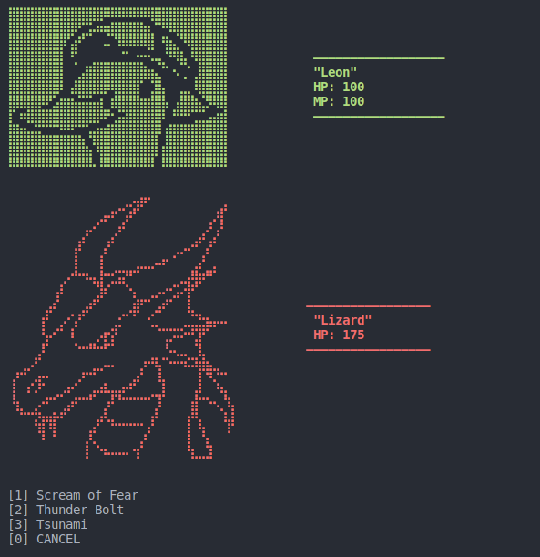

# Text Based Dungeon Crawler Project

##  Game Idea:

* The idea of the project is to create a game that the user can run through the terminal in VS Code.
* The game allows the player to go through different rooms in where there are different enemies randomly generated that the player needs to defeat.
* If the player wins the battle, experience to level up and a score will be added.
* Once the score reach 10 points, the player wins the game and can leave the dungeon.

  

## Technologies and Tools used:

* Javascript
* Node.js
* Git
* Readline-Sync (https://www.npmjs.com/package/readline-sync)
* Colors.js (https://www.npmjs.com/package/colors)

## Installation

1) Clone the repository (link)
2) Open the js file in VS Code.
3) Open the Terminal in VS Code.
4) Install npm packages with "npm i readline-sync" and "npm i colors"
5) Write node index.js in the Terminal and run the game.
6) Enjoy!

## Developers:

* Kathrine (https://github.com/dkathrine)
* Evgeniia (https://github.com/Vgenia14)
* Niko (https://github.com/Nik0Sp)
* Youssef (https://github.com/YoussefAyachi95)